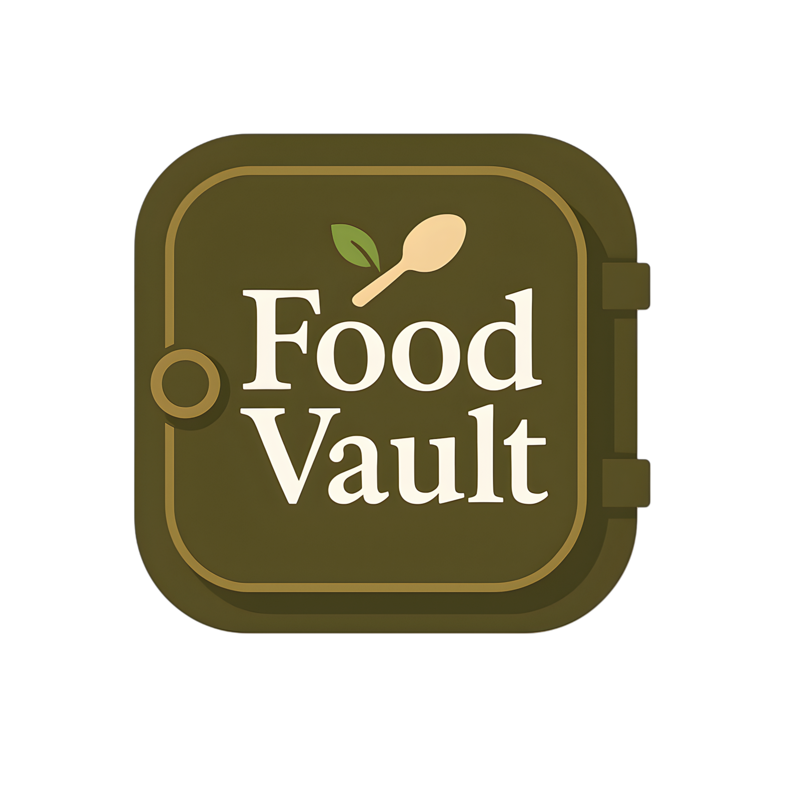

<p align="center">
  
</p>

<h1 align="center">🍲 Food Vault</h1>

<p align="center">
  <b>A modern, cross-platform recipe management app built with Flutter & Firebase</b><br/>
  <i>Because every great dish deserves a place to stay.</i>
</p>

<p align="center">
  <a href="https://flutter.dev/"></a>
  <a href="https://firebase.google.com/"></a>
  
  
  
</p>

---

## 📖 Table of Contents
- [Overview](#-overview)
- [Demo](#-demo)
- [Features](#-features)
- [Tech Stack](#-tech-stack)
- [Screenshots](#-screenshots)
- [Getting Started](#-getting-started)
- [Project Structure](#-project-structure)
- [Data Models](#-data-models)
- [Security](#-security)
- [FAQ](#-faq)
- [Contributing](#-contributing)
- [License](#-license)

---

## 📝 Overview
**Food Vault** is a beautiful, full-featured recipe management app. Users can create, browse, search, and manage recipes with rich details, images, and categories. Built with Flutter and Firebase, it runs seamlessly on mobile, web, and desktop.

> _"Because every great dish deserves a place to stay."_

---

## 🎬 Demo

<!--
Add a GIF or video demo here. Example:
-->
<p align="center">
  
</p>

---

## ✨ Features

| Category         | Features                                                                 |
|------------------|--------------------------------------------------------------------------|
| 👤 **User**      | Sign up, log in, password reset, profile editing, profile picture upload |
| 🍽️ **Recipes**   | Create, edit, delete, view, like, save, search, filter by category      |
| 🔍 **Search**    | Search by title, creator, or filter by categories                       |
| 🏠 **Feed**      | Browse all recipes, see details, view creator profiles                  |
| 💾 **Saved**     | Save favorite recipes to your profile                                   |
| ❤️ **Likes**     | Like/unlike recipes, see like counts                                    |
| 🎨 **UI/UX**     | Responsive, modern theming, custom fonts, smooth animations             |
| 🌐 **Platforms** | Android, iOS, Web, Windows, macOS, Linux                               |

---

## 🛠️ Tech Stack
- **Flutter** (Dart) — UI framework
- **Firebase** (Firestore, Auth, Storage) — Backend & Auth
- **Provider** — State management
- **Modern UI Libraries:**
  - `flutter_staggered_grid_view`, `cached_network_image`, `curved_navigation_bar`, etc.
- **CI/CD Ready** — Easily integrable with GitHub Actions, Codemagic, etc.

---


## 🚀 Getting Started

### Prerequisites
- [Flutter SDK](https://flutter.dev/docs/get-started/install) (>=3.3.0)
- [Firebase CLI](https://firebase.google.com/docs/cli)
- A Firebase project (see below)

### 1. Clone the Repository
```bash
git clone <your-repo-url>
cd Food\ vault
```

### 2. Install Dependencies
```bash
flutter pub get
```

### 3. Firebase Setup
1. Create a Firebase project at [Firebase Console](https://console.firebase.google.com/).
2. Add Android, iOS, and Web apps as needed.
3. Download `google-services.json` (Android) and `GoogleService-Info.plist` (iOS) and place them in the respective folders.
4. Update `lib/firebase_options.dart` using the [FlutterFire CLI](https://firebase.flutter.dev/docs/cli/).
5. Enable **Authentication** (Email/Password) and **Firestore Database** in Firebase Console.

### 4. Run the App
- **Mobile:**
  ```bash
  flutter run
  ```
- **Web:**
  ```bash
  flutter run -d chrome
  ```
- **Desktop:**
  ```bash
  flutter run -d windows # or macos, linux
  ```

### 5. Example Usage
- **Sign up** for a new account
- **Create** your first recipe with a photo, ingredients, and instructions
- **Browse** the feed and discover recipes from others
- **Search** for recipes by name, creator, or category
- **Save** and **like** your favorites
- **Edit your profile** and upload a profile picture

---

## 📁 Project Structure
```text
lib/
  core/
    models/         # Data models (Recipe, UserProfile)
    screens/        # UI screens (auth, home, profile, recipe, search)
    services/       # Business logic and Firebase services
    theme/          # App theming
    widgets/        # Reusable widgets
  firebase_options.dart # Firebase config
  main.dart        # App entry point
assets/
  images/          # App images
  fonts/           # Custom fonts
```

---

## 🗃️ Data Models

### Recipe
| Field         | Type         | Description                        |
|--------------|--------------|------------------------------------|
| id           | String       | Unique recipe ID                   |
| title        | String       | Recipe title                       |
| description  | String       | Short description                  |
| ingredients  | List<String> | List of ingredients                |
| instructions | List<String> | Step-by-step instructions          |
| imageUrl     | String       | Image URL                          |
| userId       | String       | Creator's user ID                  |
| userName     | String       | Creator's display name             |
| createdAt    | DateTime     | Creation timestamp                 |
| likes        | int          | Number of likes                    |
| comments     | int          | Number of comments (future)        |
| categories   | List<String> | Categories (e.g., Vegan, Dessert)  |
| cookingTime  | int          | Cooking time in minutes            |
| servings     | int          | Number of servings                 |
| difficulty   | String       | 'Easy', 'Medium', or 'Hard'        |

### UserProfile
| Field        | Type         | Description                        |
|-------------|--------------|------------------------------------|
| userId      | String       | User's unique ID                   |
| displayName | String       | Display name                       |
| age         | int          | Age                                |
| description | String       | Short bio                          |
| lastUpdated | DateTime     | Last updated timestamp             |
| savedRecipes| List<String> | IDs of saved recipes               |
| photoUrl    | String?      | Profile picture URL (optional)     |

---

## 🔒 Security
- **Authentication:** All data access requires authentication via Firebase Auth.
- **Firestore Rules:**
  - Users can only read/write their own profiles and recipes.
  - Recipes are only editable/deletable by their creators.
  - Ratings and saved recipes are protected per user.
- See [`firestore.rules`](firestore.rules) for details.

---

## ❓ FAQ

<details>
<summary><b>How do I add a new recipe?</b></summary>
<p>
Go to the <b>Home</b> screen and tap the <b>+</b> button in the navigation bar. Fill in the recipe details, add a photo, and save!
</p>
</details>

<details>
<summary><b>How do I reset my password?</b></summary>
<p>
On the login screen, tap <b>Forgot Password?</b> and follow the instructions to reset your password via email.
</p>
</details>

<details>
<summary><b>Can I use this app offline?</b></summary>
<p>
Currently, Food Vault requires an internet connection to sync with Firebase.
</p>
</details>

<details>
<summary><b>How do I contribute?</b></summary>
<p>
See the <a href="#contributing">Contributing</a> section below!
</p>
</details>

---

## 🤝 Contributing

Contributions are welcome! Please open issues or pull requests for bug fixes, features, or improvements.

1. Fork the repo
2. Create your feature branch (`git checkout -b feature/YourFeature`)
3. Commit your changes (`git commit -am 'Add some feature'`)
4. Push to the branch (`git push origin feature/YourFeature`)
5. Open a Pull Request

---

## 📄 License

This project is licensed under the MIT License.

<p align="center">
  <sub>Made with ❤️ using Flutter & Firebase</sub>
</p>
